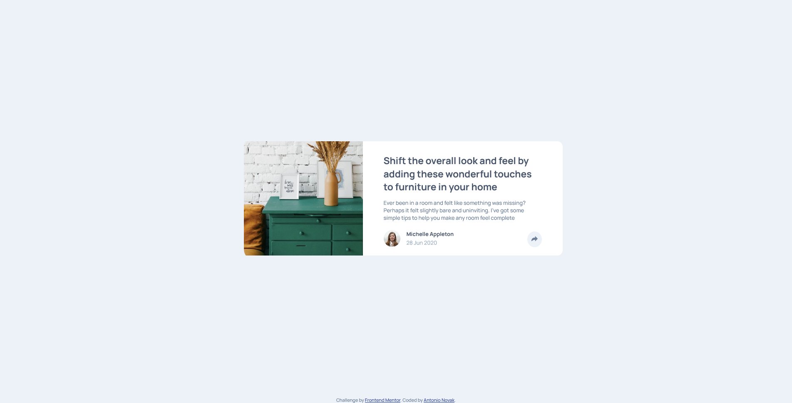

# Frontend Mentor - Article preview component solution

This is a solution to the [Article preview component challenge on Frontend Mentor](https://www.frontendmentor.io/challenges/article-preview-component-dYBN_pYFT). Frontend Mentor challenges help you improve your coding skills by building realistic projects. 

## Table of contents

- [Overview](#overview)
  - [The challenge](#the-challenge)
  - [Screenshot](#screenshot)
  - [Links](#links)
- [My process](#my-process)
  - [Built with](#built-with)
- [Author](#author)

### The challenge

Users should be able to:

- View the optimal layout for the component depending on their device's screen size
- See hover states for all interactive elements on the page
- Hide/Show the answer to a question when the question is clicked

### Screenshot

### Links

- Live Site URL: [Netlify](https://angry-pike-c97d4f.netlify.app/)

## My process

### Built with

- HTML 5
- Sass
- Flexbox
- Javascript

## Author

- Frontend Mentor - [@Nova988](https://www.frontendmentor.io/profile/Nova988)
- Github - [@Nova988](https://github.com/Nova988)
- Twitter - [@A_Nova988](https://twitter.com/A_Nova988)

